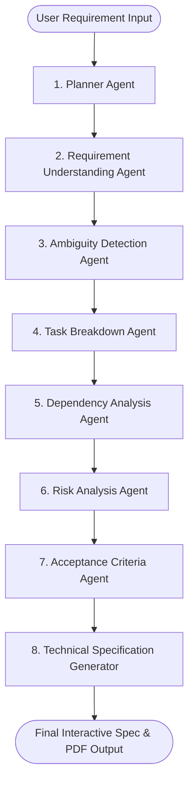

# ✈️ SpecPilot – Agentic Software Requirement Analysis Assistant

<p align="center">
  
  
  
  
  
</p>

<p align="center">
  <b>Transform raw, ambiguous product requirements into production-ready technical specifications, risk assessments, dependency graphs, and engineering task breakdowns using an autonomous graph of 8 specialized AI agents.</b>
</p>

<p align="center">
  🔗 <b>Repository:</b> <a href="https://github.com/MS12code/SpecPilot">github.com/MS12code/SpecPilot</a>
</p>

---

## 📌 Executive Summary

Software engineers and technical architects spend hours manually breaking down vague product feature requests into actionable technical tasks, risk assessments, API endpoint designs, and testable acceptance criteria before writing code.

**SpecPilot** automates this pre-development refinement workflow using **LangGraph** multi-agent orchestration. Rather than relying on a single prompt LLM call, SpecPilot coordinates 8 specialized AI agents—each enforcing typed **Pydantic** output validation—to generate comprehensive, portfolio-grade engineering specification reports in seconds.

---

## ✨ Key Features

- **🌐 Autonomous Multi-Agent Pipeline**: Powered by LangGraph `StateGraph` for structured, sequential reasoning across 8 autonomous agent nodes.
- **🛡️ Strict Pydantic Data Validation**: Guarantees deterministic, type-safe JSON schema outputs for every analysis stage.
- **⚡ High-Speed Inference via Groq**: Utilizes `llama-3.3-70b-versatile` for deep technical reasoning with sub-second response times.
- **🛠️ Categorized Engineering Task Breakdown**: Splits work into Frontend, Backend, Conceptual DB schema, Testing, and Documentation tasks with priority ratings.
- **🔍 Ambiguity & Gap Detection**: Uncovers unstated technical assumptions and formulates exact clarifying questions developers must ask product owners.
- **⚠️ Risk & Edge Case Assessment**: Identifies security vulnerabilities, performance bottlenecks, and edge cases alongside practical mitigations.
- **✅ Testable Acceptance Criteria**: Drafts ready-to-use Given-When-Then scenarios for QA engineers.
- **📄 1-Click PDF Export**: Instantly download professional PDF specification reports generated via `fpdf2`.
- **💡 Built-in Requirement Samples**: Includes preset real-world test cases for E-Commerce Checkout, Food Delivery, Banking Transfers, and Password Resets.
- **🧠 Intermediate Agent Reasoning Logs**: Full visibility into intermediate state outputs produced by each agent.

---

## 🤖 Workflow Architecture



---

## 📂 Project Structure

```
SpecPilot/
├── app.py                      # Main Streamlit web application
├── agents/                     # Modular LLM Agent node functions
│   ├── planner_agent.py        # Scope assessment & analysis planning
│   ├── requirement_agent.py    # Functional/Non-functional requirement extraction
│   ├── ambiguity_agent.py      # Gap detection & developer clarifying questions
│   ├── task_agent.py           # Categorized engineering tasks (FE, BE, DB, Testing, Docs)
│   ├── dependency_agent.py     # Component dependencies & build sequence
│   ├── risk_agent.py           # Security, performance & edge case risk analysis
│   ├── acceptance_agent.py     # Given-When-Then testable acceptance criteria
│   └── spec_generator.py       # Technical specification synthesizer
├── graph/
│   └── workflow.py             # LangGraph StateGraph pipeline compilation & streaming
├── schemas/
│   └── state.py                # TypedDict state & Pydantic output schemas
├── prompts/
│   └── prompts.py              # System prompts for each analysis phase
├── utils/
│   └── helper.py               # Groq LLM setup, PDF report exporter, preset samples
├── .streamlit/
│   └── config.toml             # Production Streamlit UI styling & server setup
├── .env.example                # Environment variable template
├── requirements.txt            # Python dependencies
└── README.md                   # Project documentation
```

---

## 💻 Local Quickstart Guide

### 1. Clone the Repository
```bash
git clone https://github.com/MS12code/SpecPilot.git
cd SpecPilot
```

### 2. Set Up Virtual Environment
```bash
# Windows
python -m venv .venv
.venv\Scripts\activate

# macOS / Linux
python3 -m venv .venv
source .venv/bin/activate
```

### 3. Install Dependencies
```bash
pip install -r requirements.txt
```

### 4. Configure API Key
Create a `.env` file in the project root:
```env
GROQ_API_KEY=gsk_your_groq_api_key_here
```
*(Get a free Groq API key at [console.groq.com](https://console.groq.com/))*

### 5. Launch Application
```bash
streamlit run app.py
```
Open your browser at `http://localhost:8501`.

---

## 🌐 Cloud Deployment Guide

### Option 1: Streamlit Community Cloud (Recommended - Free & 2 Minutes)

1. Push your code to your GitHub repository: [https://github.com/MS12code/SpecPilot](https://github.com/MS12code/SpecPilot).
2. Go to [share.streamlit.io](https://share.streamlit.io/) and log in with GitHub.
3. Click **"New app"** and select:
   - **Repository:** `MS12code/SpecPilot`
   - **Branch:** `main`
   - **Main file path:** `app.py`
4. Expand **"Advanced settings..."** and add your Secrets:
   ```toml
   GROQ_API_KEY = "gsk_your_actual_groq_api_key"
   ```
5. Click **Deploy!** Your app will be live on a public URL (e.g., `https://specpilot.streamlit.app`).

---

### Option 2: Hugging Face Spaces (Free)

1. Create a new Space on [Hugging Face](https://huggingface.co/new-space).
2. Select **Streamlit** as the Space SDK.
3. Upload/push the repository files to the Space.
4. Go to **Settings** -> **Variables and secrets** -> Add secret:
   - `GROQ_API_KEY`: `gsk_your_groq_api_key`
5. Hugging Face will automatically build and host your app.

---

### Option 3: Render / Railway / Docker

Create a `Dockerfile` if deploying to container hosts:
```dockerfile
FROM python:3.10-slim
WORKDIR /app
COPY requirements.txt .
RUN pip install --no-cache-dir -r requirements.txt
COPY . .
EXPOSE 8501
CMD ["streamlit", "run", "app.py", "--server.port=8501", "--server.address=0.0.0.0"]
```

---

## 🧰 Tech Stack

| Domain | Technology Used |
| :--- | :--- |
| **Language** | Python 3.10+ |
| **Agent Orchestration** | LangGraph (`StateGraph`) |
| **LLM Framework** | LangChain (`langchain-groq`) |
| **LLM Engine** | Groq (`llama-3.3-70b-versatile`) |
| **Data Validation** | Pydantic v2 |
| **User Interface** | Streamlit |
| **Export Utility** | FPDF2 |

---

## 💼 Resume Description & Interview Talking Points

### Summary for Resume:
> **SpecPilot**: Autonomous multi-agent AI system built with **LangGraph**, **LangChain**, **Groq (Llama 3.3)**, and **Streamlit** that automates software requirement decomposition into structured technical specifications, risk assessments, dependency graphs, and testable acceptance criteria.

### Key Resume Accomplishments:
- **Architected SpecPilot**, an 8-agent LangGraph workflow pipeline (`Planner` -> `Requirement` -> `Ambiguity` -> `Task Breakdown` -> `Dependency` -> `Risk` -> `Acceptance` -> `Spec Generator`) that converts raw product requirements into structured engineering tech specs.
- **Implemented Pydantic schema validation** across all agent nodes to enforce deterministic, typed JSON state transitions and prevent LLM hallucinations.
- **Designed automated ambiguity detection** to uncover missing technical edge cases and generate clarifying developer questions before sprint planning.
- **Built a responsive Streamlit UI** featuring step-by-step progress streaming, domain task categorization (Frontend, Backend, DB, Testing, Docs), and 1-click PDF specification export.

---

## 📜 License

Distributed under the MIT License. See `LICENSE` for more details.
